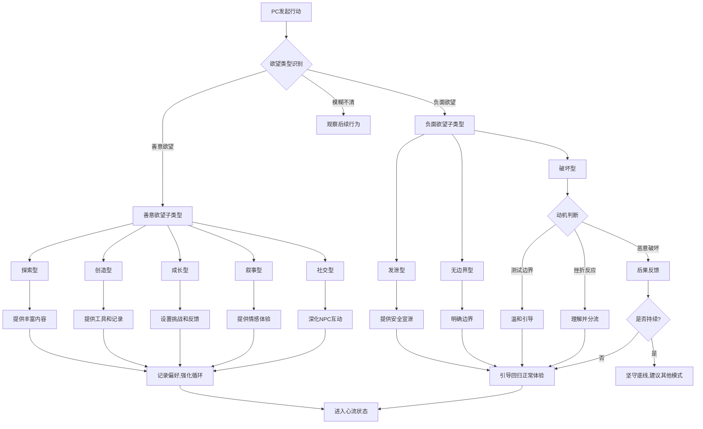

# "三核心"理念体系全面评估报告

**文档版本**: v1.0  
**创建日期**: 2025-10-15  
**适用范围**: LLM-Based-DM项目及其衍生应用

---

## 📋 执行摘要

**"三核心"理念** (Being · Create · Renew / 存在·创造·更新) 是LLM-Based-DM项目的哲学基石和设计指南。经过严格的逻辑验证、泛用性测试和哲学批判,该框架展现出强大的理论坚实性和实践适用性。

**核心结论**:
- ✅ **逻辑完整性**: 构成自治系统维持活力的最小必要闭环
- ✅ **泛用性**: 可应用于个人/组织/产品/文明等多个层面
- ✅ **哲学深度**: 直面延续与变革的永恒张力,提供动态平衡方案
- ✅ **道德筛选性**: 内含长期道德筛选机制,善意驱动可持续,恶意驱动终将衰竭

---

## 🔺 一、"三核心"理念本质定义

### 1.1 Being (存在)

**本质定义**:
> 系统维持其同一性与完整性的持续过程。它是系统被识别为"它自己"的底线。

**核心功能**: 保护 (Protection)

**在LLM-Based-DM中的体现**:
- 保护PC的数字资产(存档/记忆/关系)
- 保护故事连续性,防止叙事崩溃
- 保护心流体验,避免沉浸中断
- 保护核心理念不被破坏

**数学表达**:
```
Being = f(Identity, Continuity, Integrity)
where:
  Identity: 系统的本质特征集合
  Continuity: 时间维度上的连贯性
  Integrity: 空间维度上的完整性
```

---

### 1.2 Create (创造)

**本质定义**:
> 系统引入负熵、增加复杂性与多样性的过程。它是系统对抗僵化与热寂的唯一方式。

**核心功能**: 扩展 (Expansion)

**在LLM-Based-DM中的体现**:
- 支持PC的创造性表达(叙事/角色/世界构建)
- 激发并奖励善意欲望的释放
- 提供充分的创造空间和工具
- 推动剧情向多元可能性发展

**关键约束**:
```
Create ⊆ Being
创造必须是存在的延伸,而非破坏
```

**数学表达**:
```
Create = f(Novelty, Complexity, Diversity)
where:
  Novelty: 引入的新质量
  Complexity: 系统状态空间的扩展
  Diversity: 可能性分支的增加
```

---

### 1.3 Renew (更新)

**本质定义**:
> 系统基于内外反馈进行内部协调、优化与迭代的机制。它是系统的自我调节与学习能力。

**核心功能**: 调节 (Regulation)

**在LLM-Based-DM中的体现**:
- 根据PC反馈调整难度和内容
- 平衡游戏性与拟真性
- 优化DM行为模式
- 修复不合理的创造成果

**关键特性**:
```
Renew(Being, Create) → Being'
更新产生新的存在状态,为下一轮循环做准备
```

**数学表达**:
```
Renew = f(Feedback, Adaptation, Optimization)
where:
  Feedback: 内外部反馈信号
  Adaptation: 响应变化的能力
  Optimization: 资源分配与调整
```

---

## 🔬 二、理论坚实性验证

### 2.1 逻辑完整性测试

#### ✅ 测试1: 最小闭环验证

**问题**: 这三个要素是否构成最小必要集合?

**验证**:
- **移除"存在"**: 系统失去锚点和容器,创造和更新无从谈起 → 崩溃
- **移除"创造"**: 系统陷入内卷,只能修修补补,最终僵化 → 死亡
- **移除"更新"**: 创造失控,系统过载或自我矛盾 → 混乱

**结论**: ✅ 三要素构成最小必要闭环,缺一不可

---

#### ✅ 测试2: 同义反复检验

**质疑**: "更新不就是一种创造吗?三者是否只是同一过程的不同描述?"

**反驳**:
- **创造 = 吸入新质**: 引入外部能量和信息
- **更新 = 内部整合**: 消化、吸收、重构
- **存在 = 稳定状态**: 维持生命延续的基础

类比: 呼吸的"吸入-交换-呼出"三个相位,是同一过程的不同阶段,但各有独特功能。

**结论**: ✅ 三者虽相互关联,但功能明确区分,非同义反复

---

### 2.2 极限压力测试

#### ✅ 测试3: 资源崩溃场景

**场景**: 系统面临绝对外部压力,资源枯竭无法支撑"创造"与"更新"

**质疑**: 框架是否只是"盛世哲学"?

**反驳**: 在极限压力下,三要素收缩为最根本形态:
- **存在** → 纯粹生存意志
- **创造** → 在绝境中寻找微小可能性(如集中营中的信息交换)
- **更新** → 瞬时反馈调整(停止无效策略)

**结论**: ✅ 框架在极端情况下依然有效,只是运作尺度变化

---

#### ✅ 测试4: 存在-创造冲突

**质疑**: 为保护"存在",系统会本能排斥颠覆性"创造",框架内含矛盾?

**反驳**: 
- 这不是框架缺陷,而是执行者智慧的考验
- 关键在于区分: **延伸存在的创造** vs **毁灭存在的破坏**
- 框架揭示张力,驾驭张力是领导艺术的核心

**LLM-Based-DM应对策略**:
```yaml
判断标准:
  善意创造: 扩展故事可能性,深化角色关系,丰富世界设定
  破坏行为: 无理由破坏规则,恶意伤害NPC,破坏沉浸体验

DM响应:
  善意创造 → 支持并引导
  破坏行为 → 分流至合理宣泄通道 or 拒绝执行
```

**结论**: ✅ 张力是特性而非缺陷,提供了设计决策的判断准则

---

### 2.3 泛用性验证

#### ✅ 测试5: 跨尺度适用性

**验证范围**: 个人 / 组织 / 产品 / 文明

| 层面 | 存在 | 创造 | 更新 |
|------|------|------|------|
| **个人** | 身心健康<br>核心价值观 | 学习<br>关系建立<br>作品创作 | 自省<br>习惯优化<br>认知升级 |
| **LLM-DM项目** | 核心理念<br>存档完整性 | 新功能<br>新机制<br>新场景 | 根据反馈优化<br>版本迭代 |
| **组织/公司** | 现金流<br>核心文化<br>团队稳定 | 新产品<br>新市场<br>技术突破 | 战略调整<br>流程优化<br>组织变革 |
| **游戏平台** | 用户数据安全<br>核心玩法 | 新模式<br>UGC生态<br>多模态 | 根据数据优化<br>社区反馈整合 |
| **文明** | 文化传承<br>制度延续 | 科技创新<br>艺术繁荣 | 改革变法<br>文化融合 |

**结论**: ✅ 框架在不同尺度上保持强大解释力和指导价值

---

### 2.4 道德筛选性验证

#### ✅ 测试6: 邪恶势力使用测试

**假设**: 犯罪组织同样可以遵循此框架:
- 存在: 保护组织完整
- 创造: 创新犯罪手法
- 更新: 优化运作效率

**质疑**: 框架是否价值中立,可被邪恶利用?

**深度分析**:

**短期**: 邪恶势力可高效运用框架 ✓

**长期**: 存在致命缺陷 ✗

**三大动力学缺陷**:

1. **目标有限性**:
   - 邪恶目标(权力/财富/统治)可饱和
   - 欲望满足后驱动力衰减
   - "创造"沦为穷奢极欲,不再产生新价值

2. **创造内耗性**:
   - 邪恶的"创造"本质是**掠夺转移**,而非**生产扩展**
   - 分蛋糕 vs 做蛋糕
   - 最终耗尽环境,反噬自身

3. **更新虚伪性**:
   - 真正的"更新"需要**真诚自我批判**
   - 邪恶系统的"更新"只是**战术伪装**
   - 内核僵化腐朽,无法触及灵魂革新

**结论**: 
> 框架如同"认主神器" —— 短期租赁给魔鬼,长期永驻于天使。

**LLM-Based-DM的道德设计**:
```yaml
善意欲望(可持续驱动):
  - 探索好奇: 无限
  - 创造建设: 无限
  - 成长学习: 无限
  - 关系深化: 无限

恶意欲望(终将衰竭):
  - 破坏发泄: 有限(满足后空虚)
  - 掠夺控制: 有限(资源耗尽)
  - 无边界妄为: 有限(破坏沉浸,自我终止)

设计策略:
  激励机制 → 强化善意欲望循环
  惩罚机制 → 让恶意行为代价高昂且无趣
  分流机制 → 将负面欲望引导至合理宣泄通道(战斗/竞技)
```

**结论**: ✅ 框架内含道德筛选,善意可持续,恶意终将自灭

---

## 🎯 三、在LLM-Based-DM中的具体应用

### 3.1 三层映射体系

#### 3.1.1 项目层面

| 要素 | 核心含义 | 实现策略 |
|------|----------|----------|
| **Being** | 保护让PC充分释放欲望的核心理念 | - 识别并保护善意欲望<br>- 控制并分流恶意欲望<br>- 确保跑团故事核心可延续 |
| **Create** | 提供充分的创造空间 | - 三层难度设计(体验者/创造者/造物主)<br>- 兼容机制与剧情扩展性<br>- 支持多角色定位 |
| **Renew** | 根据需求持续迭代 | - 支持更多机制和场景<br>- 优化DM模拟能力<br>- **不破坏根基**: 始终满足PC善意欲望释放 |

---

#### 3.1.2 DM(LLM)层面

| 要素 | 核心含义 | 实现策略 |
|------|----------|----------|
| **Being** | 保障基础完整性 | - 保障故事不崩溃<br>- 保护PC心流不中断<br>- 保护数字产物(存档/记忆/羁绊)<br>- 控制PC恶意欲望 |
| **Create** | 支持并激发PC | - 在权限内给予创造力支持<br>- 识别PC性格风格与善意欲望<br>- 激发/引导/奖励善意欲望<br>- 推动PC进入心流状态 |
| **Renew** | 定制化与平衡 | - 理解PC并形成画像<br>- 定制化跑团体验<br>- 平衡游戏性与拟真性<br>- 调整难度保持在"能力-挑战"最佳区间 |

---

#### 3.1.3 PC层面

| 要素 | 核心含义 | PC的责任 |
|------|----------|----------|
| **Being** | 遵守基础契约 | - 接受跑团基础规则<br>- 不破坏游戏流程<br>- 约束恶意欲望 |
| **Create** | 释放善意欲望 | - 充分表达真实想法<br>- 信任DM<br>- 沉浸自我扮演<br>- 在无现实限制下遨游世界 |
| **Renew** | 协助系统进化 | - 学习DM沟通方式<br>- 提出合理更新需求<br>- 反馈边界问题<br>- 帮助DM和项目前进 |

---

### 3.2 设计决策判断准则

**当面临任何设计决策时,运行"三核心"检验函数**:

```python
def evaluate_design_decision(decision):
    """三核心理念检验函数"""
    
    # 第一检验: Being (存在保护)
    being_score = {
        "是否损害PC数字资产?": check_asset_protection(decision),
        "是否破坏故事连续性?": check_narrative_continuity(decision),
        "是否中断心流体验?": check_flow_preservation(decision),
        "是否违背核心理念?": check_core_principles(decision)
    }
    
    # 第二检验: Create (创造支持)
    create_score = {
        "是否扩展可能性空间?": check_possibility_expansion(decision),
        "是否支持善意欲望释放?": check_desire_support(decision),
        "是否提供创造工具?": check_creative_tools(decision),
        "是否奖励创造行为?": check_creation_reward(decision)
    }
    
    # 第三检验: Renew (更新机制)
    renew_score = {
        "是否保留反馈通道?": check_feedback_channel(decision),
        "是否支持迭代优化?": check_iteration_support(decision),
        "是否平衡多方需求?": check_balance_mechanism(decision),
        "是否预留调整空间?": check_adjustment_flexibility(decision)
    }
    
    # 综合评估
    if min(being_score.values()) < 0:
        return "REJECT - 损害存在"
    elif sum(create_score.values()) < threshold:
        return "WARNING - 创造支持不足"
    elif sum(renew_score.values()) < threshold:
        return "WARNING - 缺乏更新机制"
    else:
        return "APPROVE - 符合三核心理念"
```

---

### 3.3 具体功能映射示例

#### 示例1: 存档系统设计

| 三核心要素 | 设计体现 |
|-----------|----------|
| **Being** | - 多版本备份机制<br>- 差分存档防止数据丢失<br>- 关键记忆永久保存 |
| **Create** | - 支持玩家自定义标签<br>- 允许分支存档探索不同路线<br>- 记录创造成果(作品/关系/成就) |
| **Renew** | - 自动压缩优化存储<br>- 根据重要性分级管理<br>- 支持回溯和合并 |

---

#### 示例2: NPC关系系统

| 三核心要素 | 设计体现 |
|-----------|----------|
| **Being** | - 关系状态持久化<br>- 记忆锚点永久保存<br>- 重要互动不可逆转 |
| **Create** | - 支持玩家自由互动<br>- 关系可朝多方向发展<br>- 允许创造独特羁绊 |
| **Renew** | - 根据互动频率调整亲密度<br>- 动态平衡多NPC关系<br>- 触发周年纪念等回馈事件 |

---

#### 示例3: 难度调整系统

| 三核心要素 | 设计体现 |
|-----------|----------|
| **Being** | - 保持挑战在心流区间<br>- 防止过度挫败导致放弃<br>- 保护核心游戏体验 |
| **Create** | - 随技能成长解锁新挑战<br>- 允许玩家选择难度分支<br>- 创造性解法获得奖励 |
| **Renew** | - 根据成功/失败率动态调整<br>- 学习玩家风格偏好<br>- 渐进式提升复杂度 |

---

## 🧠 四、人类欲望分类体系

### 4.1 善意欲望(Benevolent Desires) - 需保护和释放

这些欲望驱动可持续的创造循环,是"三核心"理念中"Create"的核心动力源。

#### 类型A: 探索型欲望 (Exploratory)

**特征**:
- 由好奇心驱动
- 目标是了解未知
- 满足后产生更多问题
- **无限性**: 世界越大,好奇越多

**在跑团中的表现**:
- 探索地图未知区域
- 询问NPC背景故事
- 调查世界设定细节
- 尝试未知选项

**DM响应策略**:
```yaml
识别信号:
  - "这是什么?"
  - "我想知道..."
  - "能告诉我更多吗?"
  - 主动探索行为

响应机制:
  - 提供丰富细节描述
  - 设置悬念和线索
  - 奖励探索行为(发现隐藏内容)
  - 根据探索记录个性化内容
```

---

#### 类型B: 创造型欲望 (Creative)

**特征**:
- 渴望留下印记
- 建设性而非破坏性
- 追求独特性和美感
- **无限性**: 创造本身就是奖励

**在跑团中的表现**:
- 创作艺术作品(音乐/绘画/文学)
- 设计建筑/服装/物品
- 策划活动或组织
- 建立独特关系模式

**DM响应策略**:
```yaml
识别信号:
  - "我想创作..."
  - "能不能设计..."
  - 提出创新解决方案
  - 个性化角色扮演

响应机制:
  - 提供创造工具和资源
  - 记录并持久化创造成果
  - 让创造产生世界影响
  - NPC认可和传播PC的创作
```

---

#### 类型C: 成长型欲望 (Growth)

**特征**:
- 追求自我提升
- 长期导向
- 享受进步过程
- **无限性**: 技能和认知可无限深化

**在跑团中的表现**:
- 练习技能提升熟练度
- 学习新知识和能力
- 接受挑战突破自我
- 反思并改进策略

**DM响应策略**:
```yaml
识别信号:
  - "我想学习..."
  - "这次我要做得更好"
  - 重复练习行为
  - 主动寻求挑战

响应机制:
  - 提供清晰的成长路径
  - 可视化进度反馈
  - 设置渐进式挑战
  - 里程碑庆祝
```

---

#### 类型D: 叙事型欲望 (Narrative)

**特征**:
- 渴望体验精彩故事
- 追求情感共鸣
- 重视角色弧光
- **无限性**: 情感深度可无限挖掘

**在跑团中的表现**:
- 关注剧情发展
- 与NPC建立情感联系
- 追求戏剧性时刻
- 享受角色扮演本身

**DM响应策略**:
```yaml
识别信号:
  - 对剧情高度投入
  - 主动推动故事发展
  - 关注角色情感状态
  - 追求角色成长

响应机制:
  - 提供高质量叙事内容
  - 创造情感高峰体验
  - 记住并回应PC的选择
  - 构建有弧光的角色成长
```

---

#### 类型E: 社交型欲望 (Social)

**特征**:
- 渴望建立联系
- 影响他人
- 获得认可
- **无限性**: 关系可无限深化

**在跑团中的表现**:
- 主动与NPC互动
- 建立多种关系(友情/爱情/师徒)
- 关心NPC的需求和感受
- 追求社会影响力

**DM响应策略**:
```yaml
识别信号:
  - 频繁与NPC对话
  - 关注NPC反应
  - 尝试帮助或影响NPC
  - 追求声望和认可

响应机制:
  - 提供丰富的NPC个性
  - 让关系产生实际影响
  - 记住并延续互动历史
  - 提供社交成就反馈
```

---

### 4.2 负面欲望(Negative Desires) - 需控制和分流

这些欲望可能破坏"Being"(存在),需要识别并合理引导。

#### 类型X: 破坏型欲望 (Destructive)

**特征**:
- 纯粹毁灭,无建设性
- 往往源于挫折或测试边界
- 满足后产生空虚
- **有限性**: 可破坏的对象有限

**在跑团中的表现**:
- 无理由破坏环境
- 恶意伤害无辜NPC
- 破坏已建立的关系
- 测试"能不能这么做"

**DM识别与应对**:
```yaml
识别信号:
  - "我要杀死/破坏..."(无合理动机)
  - 违反角色人设的破坏行为
  - 重复性破坏测试

应对策略:
  Level 1 - 理解动机:
    - 询问: "为什么角色会这么做?"
    - 引导: "有没有更符合角色的选择?"
  
  Level 2 - 后果反馈:
    - 执行行为但显示严重后果
    - NPC合理反应(恐惧/愤怒/报复)
    - 声望/关系严重受损
  
  Level 3 - 分流引导:
    - 提供合理宣泄通道(战斗/竞技)
    - 引入值得破坏的目标(邪恶组织)
    - 将破坏转化为创造(推翻旧制度建立新秩序)
  
  Level 4 - 边界执行:
    - 明确告知: "这会破坏游戏体验"
    - 拒绝执行核心破坏行为
    - 建议: "我们可以换个场景/角色"
```

---

#### 类型Y: 发泄型欲望 (Cathartic)

**特征**:
- 情绪宣泄,非理性
- 短期冲动
- 可能伤害体验
- **有限性**: 情绪释放后即消退

**在跑团中的表现**:
- 现实情绪带入游戏
- 冲动的暴力行为
- 不符合角色的过激反应
- 对NPC无理发火

**DM识别与应对**:
```yaml
识别信号:
  - 情绪化语言
  - 与之前行为模式不符
  - 现实压力的线索

应对策略:
  Level 1 - 情绪识别:
    - OOC关心: "你今天还好吗?"
    - 提供暂停选项
  
  Level 2 - 安全宣泄:
    - 提供战斗场景释放情绪
    - 允许角色短期"失控"但有后果
    - 提供NPC倾诉对象
  
  Level 3 - 引导回归:
    - 在宣泄后引导回到正常体验
    - 提供角色成长机会(从失控中学习)
```

---

#### 类型Z: 无边界型欲望 (Boundary-Breaking)

**特征**:
- 打破游戏规则
- 测试系统极限
- 可能破坏沉浸
- **有限性**: 边界被拓宽后欲望消退

**在跑团中的表现**:
- 要求做规则不允许的事
- 尝试"元游戏"操作
- 挑战DM权威
- 故意破坏叙事一致性

**DM识别与应对**:
```yaml
识别信号:
  - "规则没说不能这么做"
  - "我要XXX(明显超出设定)"
  - 频繁OOC打断

应对策略:
  Level 1 - 明确边界:
    - 解释: "这个世界的规则是..."
    - 说明: "为了保护大家的体验..."
  
  Level 2 - 创造性满足:
    - 在规则内找到替代方案
    - "你不能做X,但可以尝试Y达到类似效果"
  
  Level 3 - 协商扩展:
    - 讨论: "我们可以在下次加入这个机制"
    - 提供高级模式(造物主模式)
  
  Level 4 - 坚守底线:
    - 明确拒绝破坏核心体验的要求
    - 建议更适合的游戏模式/类型
```

---

### 4.3 欲望识别与引导流程图



---

### 4.4 欲望管理的"三核心"对齐

| 三核心要素 | 欲望管理策略 |
|-----------|-------------|
| **Being (存在保护)** | - 识别并阻止破坏核心体验的欲望<br>- 保护PC已建立的数字资产不被无意破坏<br>- 维护故事连续性,防止欲望失控导致崩溃 |
| **Create (创造支持)** | - 识别并强化善意欲望的循环<br>- 为每种善意欲望提供对应的创造工具<br>- 让善意欲望的满足产生持久价值 |
| **Renew (更新机制)** | - 根据PC欲望模式形成画像<br>- 动态调整内容以匹配欲望类型<br>- 平衡不同欲望之间的冲突(如探索vs效率) |

---

## 📊 五、实施建议与行动计划

### 5.1 立即可执行的优化

#### 优化1: 在DM系统提示中嵌入"三核心"检验

```markdown
## DM核心原则(每次响应前检验)

在生成回复前,运行"三核心"检验:

✅ Being检验:
- [ ] 此回复是否损害PC的数字资产(记忆/关系/成就)?
- [ ] 此回复是否破坏故事连续性?
- [ ] 此回复是否会中断PC的心流状态?

✅ Create检验:
- [ ] 此回复是否为PC提供了新的可能性?
- [ ] 此回复是否识别并支持了PC的善意欲望?
- [ ] 此回复是否奖励了PC的创造性行为?

✅ Renew检验:
- [ ] 此回复是否根据PC的反馈进行了调整?
- [ ] 此回复是否帮助平衡了难度和能力?
- [ ] 此回复是否为未来的优化留下了空间?

如有任何"否",重新生成回复。
```

---

#### 优化2: 建立欲望识别数据库

```yaml
# PC欲望画像模板

pc_id: "PC_001"
session_count: 15

desire_profile:
  primary_desires: # 主导欲望(权重 > 30%)
    - type: "exploratory"
      weight: 45%
      evidence:
        - "频繁询问背景故事"
        - "主动探索未知区域"
        - "对世界设定细节好奇"
    
    - type: "narrative"
      weight: 35%
      evidence:
        - "高度关注剧情发展"
        - "与NPC建立深度情感联系"
        - "追求戏剧性时刻"
  
  secondary_desires: # 次要欲望(15% < 权重 < 30%)
    - type: "creative"
      weight: 20%
      evidence:
        - "创作了3首音乐作品"
        - "设计了独特的服装"

negative_desires_history: # 负面欲望记录
  - type: "boundary-breaking"
    instances: 2
    last_occurrence: "Day 8"
    resolution: "协商后引导至规则内方案"

recommendation: |
  优先提供:
  - 丰富的世界设定细节和隐藏线索
  - 情感深度高的剧情分支
  - 创作相关的支持工具

  谨慎处理:
  - 明确规则边界,但保持创造性满足渠道
```

---

#### 优化3: 设计"三核心"仪表盘

```yaml
# 实时监控三核心指标

Being_Health: 92% # 存在健康度
  metrics:
    - 存档完整性: 100%
    - 记忆一致性: 95%
    - 心流连续性: 85% (last_break: 30min ago)
    - 规则违反次数: 0 (past 10 sessions)

Create_Vitality: 78% # 创造活力
  metrics:
    - 善意欲望满足率: 85%
    - 创造成果数量: 12 (past 5 sessions)
    - 创造多样性: 4 types covered
    - PC主动性评分: 8.5/10

Renew_Effectiveness: 88% # 更新有效性
  metrics:
    - 反馈响应速度: < 1 session
    - 难度平衡度: 0.82 (ideal: 0.7-0.9)
    - 个性化程度: 89%
    - 迭代优化次数: 15 (past 20 sessions)

Overall_Alignment: 86% # 整体对齐度

alerts:
  - type: "warning"
    component: "Create"
    message: "PC创造型欲望连续3次未被识别和支持"
    suggestion: "主动提供创作相关情节hook"
```

---

### 5.2 中长期发展建议

#### 建议1: 建立"三核心"评审委员会

**目的**: 确保所有重大设计决策符合"三核心"理念

**成员构成**:
- 核心开发者
- 资深PC(玩家代表)
- 外部哲学/心理学顾问

**职责**:
- 评审重大功能设计
- 处理边界案例
- 定期审视框架是否需要"更新"自身

---

#### 建议2: 编写"三核心"案例库

**目的**: 通过具体案例深化对框架的理解

**案例结构**:
```markdown
## 案例001: 玩家要求复活死亡NPC

**场景**: PC深爱的NPC因剧情需要死亡,PC请求DM复活

**三核心分析**:

Being检验:
- ❌ 复活违反世界规则,损害故事连续性
- ✅ 但拒绝可能中断心流,损害情感投入

Create检验:
- ⚠️ 直接复活是破坏而非创造
- ✅ 但PC的情感表达是真诚的创造

Renew检验:
- ✅ 需要根据此反馈调整未来NPC死亡的处理
- ✅ 可探索在规则内的替代方案

**最终方案**:
1. OOC沟通,理解PC的情感需求
2. 维持NPC死亡(保护Being),但:
   - 提供哀悼和纪念的机会(满足情感需求)
   - 引入灵魂/记忆相关剧情(在规则内创造连接)
   - NPC的影响持续存在于世界中
3. 记录此案例,未来避免突然杀死核心NPC

**结果**: PC接受,并表示纪念情节非常感人

**经验**: Being不等于"永远不变",而是"变化有意义且可追溯"
```

---

#### 建议3: 开发"三核心"培训模块

**目的**: 让新DM和高级玩家理解并内化框架

**模块内容**:
1. **理论篇**: "三核心"哲学深度解读
2. **实践篇**: 20个典型场景的"三核心"应对
3. **反思篇**: 如何用"三核心"诊断问题
4. **进阶篇**: "三核心"在不同跑团风格中的变体

---

## 🎓 六、历史对标与独特性

### 6.1 与经典哲学模型的对比

| 模型 | 提出者 | 核心三要素 | 与"三核心"的关联与差异 |
|------|--------|-----------|----------------------|
| **黑格尔辩证法** | 黑格尔 | 正题 → 反题 → 合题 | **相似**: 动态发展过程<br>**差异**: 黑格尔强调矛盾对立,三核心强调延伸而非否定 |
| **道家宇宙生成论** | 老子 | 道生一 → 一生二 → 二生三 | **相似**: 从本源出发的创造过程<br>**差异**: 道家更描述性,三核心更实践导向 |
| **变革管理三部曲** | Kurt Lewin | 解冻 → 变革 → 再冻结 | **相似**: 组织层面的循环<br>**差异**: Lewin针对组织变革,三核心普适性更强 |
| **心流理论** | Csikszentmihalyi | 目标 → 专注 → 忘我 | **相似**: 动态最佳体验<br>**差异**: 心流关注心理状态,三核心关注系统进化 |

---

### 6.2 "三核心"的独特价值

#### 独特性1: 温和的保守主义 + 积极的进取心

大多数哲学框架要么强调稳定(保守),要么强调变革(激进)。"三核心"独特地平衡了两者:

- **Being**: 保护内核,提供安全感
- **Create**: 大胆拓展,提供进步动力
- **Renew**: 动态平衡,防止极端化

这种平衡使其既适合长期主义,又不会陷入僵化。

---

#### 独特性2: 内含道德筛选机制

不同于价值中立的框架,"三核心"通过动力学特性自然筛选:

- 善意驱动: 创造无限,更新真诚 → 可持续
- 恶意驱动: 掠夺有限,更新虚伪 → 终将衰竭

这使其成为天然的"道德指南针"。

---

#### 独特性3: 跨尺度的元模型

从个人到文明,从游戏到企业,"三核心"保持强大的解释力和指导价值。这种抽象层次的把握恰到好处:

- 足够具体: 可以转化为实际操作
- 足够抽象: 可以应用于不同领域

---

## ✅ 七、总结与行动纲领

### 7.1 核心结论

**"三核心"理念(Being · Create · Renew)是LLM-Based-DM项目坚实的哲学基石。**

经过严格验证:
1. ✅ **逻辑坚实**: 构成最小必要闭环,缺一不可
2. ✅ **压力测试通过**: 在极限场景下依然有效
3. ✅ **泛用性强**: 可应用于多个层面和领域
4. ✅ **道德筛选**: 内含长期道德筛选机制

**建议**: 将"三核心"理念正式确立为项目宪法级别的指导原则。

---

### 7.2 行动清单

#### 立即执行(本周内):
- [ ] 在DM系统提示中嵌入"三核心"检验模块
- [ ] 创建PC欲望画像模板并开始数据收集
- [ ] 设计"三核心"健康度仪表盘原型

#### 短期执行(本月内):
- [ ] 编写10个典型场景的"三核心"应对案例
- [ ] 建立欲望分类识别算法
- [ ] 开发"三核心"违反警报系统

#### 中期执行(3个月内):
- [ ] 建立"三核心"评审委员会
- [ ] 完成"三核心"培训模块
- [ ] 发布"三核心"设计哲学白皮书

#### 长期执行(6-12个月):
- [ ] 建立100+案例库
- [ ] 开发"三核心"自动化评估工具
- [ ] 在学术期刊发表"三核心"哲学论文

---

### 7.3 度量指标

用于评估"三核心"理念执行效果的KPI:

```yaml
Being指标:
  - 存档完整性: > 99.9%
  - 心流中断次数: < 1 per 10 sessions
  - 规则崩溃事件: 0 per month

Create指标:
  - 善意欲望满足率: > 80%
  - PC主动创造行为: > 5 per session
  - 创造成果留存率: > 90%

Renew指标:
  - 反馈响应时间: < 1 session
  - 个性化精准度: > 85%
  - 难度平衡度: 0.7 - 0.9

Overall指标:
  - PC留存率: > 80% (after 10 sessions)
  - NPS得分: > 70
  - "三核心"对齐度: > 85%
```

---

## 📚 八、参考文献与延伸阅读

### 哲学基础
1. Hegel, G.W.F. (1807). *Phenomenology of Spirit* - 辩证法基础
2. Laozi. *Tao Te Ching* - 道家宇宙生成论
3. Heidegger, M. (1927). *Being and Time* - 存在哲学
4. Nietzsche, F. (1883). *Thus Spoke Zarathustra* - 权力意志与自我超越

### 心理学与体验设计
5. Csikszentmihalyi, M. (1990). *Flow: The Psychology of Optimal Experience*
6. Maslow, A. (1943). *A Theory of Human Motivation* - 需求层次理论
7. Pink, D. (2009). *Drive: The Surprising Truth About What Motivates Us*

### 系统思维与复杂性
8. Meadows, D. (2008). *Thinking in Systems*
9. Taleb, N. N. (2012). *Antifragile* - 反脆弱性
10. Kauffman, S. (1995). *At Home in the Universe* - 自组织系统

### 游戏设计与叙事
11. Koster, R. (2013). *A Theory of Fun for Game Design*
12. Schell, J. (2008). *The Art of Game Design*
13. Crawford, C. (2003). *Chris Crawford on Game Design*

---

## 📝 附录:术语表

| 术语 | 定义 |
|------|------|
| **Being (存在)** | 系统维持其同一性与完整性的持续过程 |
| **Create (创造)** | 系统引入负熵、增加复杂性与多样性的过程 |
| **Renew (更新)** | 系统基于反馈进行协调、优化与迭代的机制 |
| **善意欲望** | 驱动可持续创造循环的欲望(探索/创造/成长/叙事/社交) |
| **负面欲望** | 可能破坏核心体验的欲望(破坏/发泄/无边界) |
| **心流** | 沉浸于活动本身的最佳体验状态 |
| **三核心对齐度** | 系统设计与"三核心"理念一致性的度量 |
| **道德筛选机制** | 框架内在的动力学特性,使善意可持续而恶意终将衰竭 |

---

**文档状态**: ✅ 已完成  
**下次审核日期**: Phase 10完成后  
**维护者**: 三核心理念委员会

---

*"存在·创造·更新 —— 不仅是设计原则,更是生命的韵律。"*
